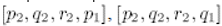
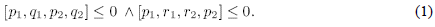
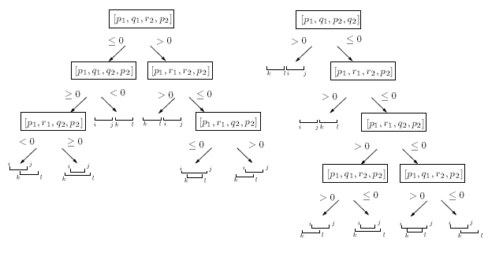
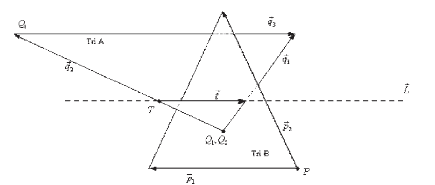

# **Задача поиска пересечения многогранных тел, алгоритмы и структуры данных.**

##  **1. Введение**

Обнаружение столкновений – это фундаментальная проблема во многих дисциплинах, включая компьютерную анимацию, виртуальную реальность, твердотельное моделирование и вычислительную геометрию. Даны два объекта, конкретно – две полигональные модели, цель – определить пересекаются ли они или нет.

Естественный подход тестирования примитивов одной модели на пересечение со всеми примитивами другой требует огромное количество тестов пересечений(triangle-to-triangle). Т.о. многие алгоритмы были разработаны с целью уменьшить количество операций использованием иерархических структур данных. Все эти структуры данных значительно уменьшают количество тестов пересечений, однако на нижних уровнях иерархии такие тесты все равно должны выполняться.

Т.н. метод «грубой силы» или полного перебора для определения пересечения двух треугольников в трехмерном пространстве требует решения шести линейных уравнений, каждое из которых соответствует пересечению одного ребра треугольника с поверхностью другого. Были предложены более быстрые алгоритмы, которые находят линию пересечения двух треугольников. Мёллер(1998) предложил алгоритм, который основывается на скалярных проекциях вершин треугольников на эту линию. Хельд(1997) использовал технику, которая сначала вычисляет линейный сегмент пересечения одного треугольника с этой линией, а затем проверяет на пересечение этот сегмент с ребрами другого треугольника. Оба метода в дальнейшем были усовершенствованы, чтобы получить более быстрые и надежные варианты. Один из алгоритмов, который являлся улучшением алгоритма Мёллера, был предложен Guigue и Devillers(2004). Их метод опирается исключительно на вычисление ориентационных предикатов(определители 4х4) и не требует никаких вспомогательных конструкций.

Все перечисленные методы смотрят на проблему с геометрической точки зрения. Oren Tropp, Ilan Shimshoni(2005) предложили подойти к проблеме с алгебраической точки зрения. Их метод основан на алгоритме полного перебора. Найдя связь в наборах уравнений, они сильно упростили решение систем.

Для сложных объектов более эффективен подход, в основу которого положено постепенное продвижение к оболочке, внутри которой находится объект, путем усложняющегося разбиения окружаю­щего пространства на простые многогранники (чаще всего - параллелепипеды).

При этом проверка на пересечение простых многогран­ников, по-прежнему, производится «в лоб», то есть прямым перебором пар, но тотальная проверка пересечений сеток, описывающих объекты, заменяется на проверку пересечений ограничивающих многогранников. Лишь на завершающих фазах (когда грани некоторых ограничивающих многогранников близки к некоторым «подозрительным» участкам се­ток) осуществляется тотальная проверка пере­сечения только таких «вычисленных» участ­ков сеток. В итоге, общее число проверок уда­ется понизить благодаря использованию отно­сительно небольшого числа простых по форме ограничивающих объемов.

Эффективность алгоритмов проверки столкновений, основанных на последователь­ном разбиении ограничивающего пространст­ва, зависит от многих факторов: способа и по­рядка декомпозиции пространства, формы и ориентации ограничивающих многогранни­ков, формы самого объекта, способа оптими­зации разбиения и т.д. Существует много под­ходов к повышению производительности и эффективности этих алгоритмов. Большинст­во из них сводится к поиску такого способа декомпозиции (в широком смысле), ограничи­вающего объект пространства (почти всегда она оказывается иерархической), при котором сильнее всего уменьшается число пар объек­тов или примитивов, которые нужно прове­рять на пересечение.

Октантные деревья, k-мерные и *BSP*-деревья (бинарные), тетраидальные сетки, регулярные решетки - все это примеры такого поиска различных механиз­мов декомпозиции пространства.

Разделяя пространство, занимаемое объектами, можно проверять контакт только между теми объектами или их частями, кото­рые находятся внутри или около полученного в результате такого деления элемента про­странства, что обеспечивает ускорение про­цесса проверки пересечений.

Конструируя иерархии объектов, мож­но добиваться аппроксимации объектов с воз­растающей точностью, до тех пор пока не бу­дет достигнута их истинная геометрическая форма. В качестве аппроксимирующих про­странств можно использовать сферы, диски, ориентированные вдоль осей координат параллелепипеды *(axis - aligned bounding boxes* - *ААВВ*), произ­вольно ориентированные параллелепипеды *(oriented bounding boxes* - *OBB)*, выпуклые многогранники с к-гранями, определенными полупространст­вами с нормалями, ориентированными в *к* фиксированных направлениях (*к-dop*) (discrete orientation polytopes). Для того чтобы пред­ставить эти пространственные структуры, ап­проксимирующие объекты, приведем их дву­мерные изображения (рис. 1).

>  
>Рис.1. Аппроксимация объекта с помощью четырех пространственных структур: AABB(а); сферы(б); OBB(в); k-dop(k=8)(г)

## **2. Структуры данных**

### **2.1 [BSP-trees(Naylor, 1990)](https://github.com/ResidentTGT/Doc/blob/master/merging%20bsp%20trees%20yields(naylor%201990).pdf)**

Двоичное разбиение пространства ([англ.](https://ru.wikipedia.org/wiki/%D0%90%D0%BD%D0%B3%D0%BB%D0%B8%D0%B9%D1%81%D0%BA%D0%B8%D0%B9_%D1%8F%D0%B7%D1%8B%D0%BA) *binary space partitioning*) — метод [рекурсивного](https://ru.wikipedia.org/wiki/%D0%A0%D0%B5%D0%BA%D1%83%D1%80%D1%81%D0%B8%D1%8F) разбиения [евклидова пространства](https://ru.wikipedia.org/wiki/%D0%95%D0%B2%D0%BA%D0%BB%D0%B8%D0%B4%D0%BE%D0%B2%D0%BE_%D0%BF%D1%80%D0%BE%D1%81%D1%82%D1%80%D0%B0%D0%BD%D1%81%D1%82%D0%B2%D0%BE) в [выпуклые множества](https://ru.wikipedia.org/wiki/%D0%92%D1%8B%D0%BF%D1%83%D0%BA%D0%BB%D0%BE%D0%B5_%D0%BC%D0%BD%D0%BE%D0%B6%D0%B5%D1%81%D1%82%D0%B2%D0%BE) и [гиперплоскости](https://ru.wikipedia.org/wiki/%D0%93%D0%B8%D0%BF%D0%B5%D1%80%D0%BF%D0%BB%D0%BE%D1%81%D0%BA%D0%BE%D1%81%D1%82%D1%8C). В результате объекты получают представление в виде структуры данных, называемой *BSP-деревом*.

В *BSP-дереве* каждый узел связан с разбивающей прямой или плоскостью в 2-мерном или 3-мерном пространстве соответственно. При этом все объекты, лежащие с фронтальной стороны плоскости относятся к фронтальному поддереву, а все объекты, лежащие с оборотной стороны плоскости относятся к оборотному поддереву. Для определения принадлежности объекта к фронтальной или оборотной стороне разбивающей прямой или плоскости необходимо исследовать положение каждой его точки. Положение точки относительно плоскости определяется [скалярным произведением](https://ru.wikipedia.org/wiki/%D0%A1%D0%BA%D0%B0%D0%BB%D1%8F%D1%80%D0%BD%D0%BE%D0%B5_%D0%BF%D1%80%D0%BE%D0%B8%D0%B7%D0%B2%D0%B5%D0%B4%D0%B5%D0%BD%D0%B8%D0%B5) [нормали](https://ru.wikipedia.org/wiki/%D0%9D%D0%BE%D1%80%D0%BC%D0%B0%D0%BB%D1%8C) плоскости и координат точки в [однородных координатах](https://ru.wikipedia.org/wiki/%D0%9E%D0%B4%D0%BD%D0%BE%D1%80%D0%BE%D0%B4%D0%BD%D1%8B%D0%B5_%D0%BA%D0%BE%D0%BE%D1%80%D0%B4%D0%B8%D0%BD%D0%B0%D1%82%D1%8B). Возможно три случая:

1)Скалярное произведение больше 0 — точка лежит с фронтальной стороны плоскости;

2)Скалярное произведение равно 0 — точка лежит на плоскости;

3)Скалярное произведение меньше 0 — точка лежит с обратной стороны плоскости.

Если для всех точек объекта скалярное произведение больше или равно 0, то он относится к фронтальному поддереву. Если для всех точек объекта скалярное произведение меньше или равно 0, то он относится к оборотному поддереву. Если скалярные произведения для точек объекта имеют разный знак, то он рассекается разбивающей плоскостью так, чтобы полученные объекты лежали только с фронтальной или только с оборотной стороны. Для каждого подузла *BSP-дерева* справедливо вышеприведенное утверждение, с тем исключением, что рассмотрению подлежат только те объекты, которые принадлежат к фронтальной или оборотной стороне разбивающей плоскости родительского узла.

Как правило, *BSP-дерево* строится для набора отрезков на плоскости или полигонов в пространстве, представляющих некоторую фигуру или сцену. Рассмотрим алгоритм построения BSP-дерева для набора полигонов в пространстве:

1)Если заданное множество полигонов пустое, то закончить алгоритм;

2)Для заданного множества полигонов выбрать разбивающую плоскость S;

3)Рассечь все полигоны, пересекающиеся с S;

4)Отнести все полигоны, находящиеся с фронтальной стороны S, к фронтальному поддереву F, а все полигоны, находящиеся с обратной стороны S, к оборотному поддереву B;

5)Выполнить алгоритм рекурсивно для множества полигонов фронтального поддерева F;

6)Выполнить алгоритм рекурсивно для множества полигонов оборотного поддерева B.

Рис.2.

Разбивающая плоскость выбирается таким образом, чтобы сбалансировать дерево, то есть чтобы число полигонов во фронтальном и оборотном поддереве было приблизительно одинаково:

min(|N(Fi) — N(Bi)|)

где N(Fi) — число полигонов с фронтальной стороны некоторой разбивающей плоскости i, N(Bi) — число полигонов с оборотной стороны разбивающей плоскости i.

### **2.2 Процедура построения октантного дерева.**

Сначала создаётся квадрат, в который многоугольник помещается целиком. Для этого находится максимальные и минимальные координаты по Х и по Y. Далее находится сторона квадрата и его центр. Этот квадрат называется корневым октантом. Затем корневой октант делится на 4 октанта, после чего анализируется их положение по отношению к многоугольнику. Если октант находится полностью внутри многоугольника, он считается «чёрным»; если снаружи – «белым». Если же октант частично лежит внутри многоугольника, а частично – снаружи, то он считается «серым» и делится на четыре октанта меньшего размера. Чёрные и белые октанты дальше не делятся. Процедура продолжается до тех пор, пока не будет достигнут заданный уровень разбиения. «Цвет» определяется следующим образом: проверяется, пересекаются ли стороны октанта со сторонами многоугольника (с помощью функции AutoLisp inters). Если стороны октанта пересекаются со сторонами многоугольника, то октант считается «серым». Иначе октант лежит внутри либо снаружи многоугольника. Чтобы определить его «цвет» подсчитывается количество пересечений отрезка лежащего между центром октанта и одной из вершин корневого октанта со сторонами многоугольника. Если количество пересечений чётное или ноль, то квадрат лежит снаружи многоугольника и считается «белым». Иначе если количество пересечений нечётное, то он лежит внутри многоугольника и считается «чёрным». На чертеже рисуются только октанты внутри треугольника.

Рис.3.

### **2.3 [OBBTree](https://github.com/ResidentTGT/Doc/blob/master/OBB.pdf)**

OBB- это прямоугольный охватывающий объём, случайно ориентированный в трехмерном пространстве. Результирующая иерархическая структура – это т.н. «дерево» из таких OBBs. В сравнении с другими иерархическими представлениями моделей(при помощи сфер и осе-ориентированных баундинг-боксов) OBBs дают наибольшую точность модели и наивысшую скорость поиска пересечений между ними в случаях близкого расположения различных участков моделей.

Рис.4. Точность различных баундинг-боксов

Конструкция дерева имеет две компоненты: 1)расположение охватывающих OBB среди полигонов; 2)группировка внедренных OBB в дереве иерархии.

Рис.5. Построение OBB-модели

Рис.6. Дерево OBB-модели

## **3. Алгоритмы нахождения пересечения**

### **3.1 [Алгоритм Мёллера(1998)](https://github.com/ResidentTGT/Doc/blob/master/A%20Fast%20Triangle-Triangle%20Intersection%20Test%20Moller.PDF)**

Введем два треугольника T1 и T2 с вершинами V01 , V11 , V21 и V02 , V12 , V22 соответственно и плоскости, в которых лежат треугольники π­­­1 и π­­­2.

Уравнение плоскости π­­­2: N2∙X+d2=0(где X - любая точка на плоскости) вычисляется:

Подставив вершины в уравнение плоскости, вычисляются расстояния ( с учетом знака) от вершин треугольника T1 до плоскости π­­­2 :

Если все расстояния не равны нулю и имеют одинаковый знак, то треугольник T1 лежит по одну сторону от плоскости π­­­2, и пересечение отклоняется. То же самое делается для треугольника T2 и плоскости π­­­1. Два ранних теста позволяют избежать множество вычислений для пар треугольников.

Если все расстояния равны 0, то треугольники компланарны. Если нет, то пересечение π­­­1 и π­­­2 – линия, L=O+t∙D, где D=N1×N2 – направление линии, а O – точка на ней. Из-за предыдущих тестов можно гарантировать, что оба треугольника пересекают L. Эти пересечения формируют интервалы на линии L, и если эти интервалы перекрываются, то треугольники также пересекаются. Две ситуации, которые могут произойти, показаны на рис.2.

Рис. 7.

Предположим, что мы хотим вычислить скалярный интервал(на L), который является пересечением между T1 и L, и, например, V01\\ ­и V21 лежат на одной стороне от плоскости π­­­2 , а V11 – на другой. Чтобы найти скалярные величины, которые представляют пересечение между ребрами V01 V11 и V11 V21 и L, вершины сначала проецируются на L:

Геометрия представлена на Рис.3.

Рис.8.

Затем мы вычисляем значение линейного параметра t1 для B= V01 V11∩L=O+t1∙D. Ki1 обозначают проекцию Vi1 на плоскость π­­­2. Можно заметить, что  подобен , тогда

Такие же вычисления проводятся для парметра t2.

Этапы алгоритма:

1.  Вычислить уравнение треугольника 2.

2.  Проверить, не лежат ли все точки треугольника 1 с одной стороны.

3.  Вычислить уравнение треугольника 1.

4.  Проверить, не лежат ли все точки треугольника 2 с одной стороны.

5.  Вычислить линию пересечения и проецировать вершины на оси.

6.  Вычислить интервалы для каждого треугольника.

7.  Пересечь интервалы.

### **3.2 [Алгоритм Guigue и Devillers(2004)](https://github.com/ResidentTGT/Doc/blob/master/faster%20tr-tr%20intersection%20tests%20by%20Devillers%20and%20Guigue.pdf)**

Они предлагают новую формулировку предиката(геометрического теста) пересечения двух треугольников в трехмерном пространстве. Предикат – это часть кода, которая решает базовый вопрос геометрии. Эта формулировка может быть разбита на маленькое число трехмерных ориентационных тестов. Это большое преимущество по сравнению с реализацией этих предикатов у Мёллера и Хельда.

Каждая вершина каждого треугольника классифицируется по отношению к другим треугольникам, используя шестиориентационные предикаты.

Рис.9.

Как и Мёллер, они начинают с проверки взаимного пересечения каждого треугольника с плоскостью другого. Треугольник 1 тестируется на пересечение с плоскостью 2.Для этого алгоритм классифицирует вершины тр.1 по отношению к плоскости 2 простым сравнением знаков трех определителей . Возможны три различные ситуации:

1)все три определителя одинакого знака и ни один из них не равен 0

2)все три определителя равны 0

3)определители имеют разные знаки

Случай 1 происходит, когда все три вершины тр.1 лежат по 1 сторону от пл.2. Случай 2 происходит, когда оба треугольника компланарны и определяют одну и ту же плоскость. Случай 3 происходит, когда вершины треугольника 1 лежат по разные стороны от плоскости 2 и тр.1. пересекает пл.2. Затем также проверяется пересеченеи тр.2 и пл.1.

Далее алгоритм применяет круговые перестановки вершин каждого треугольника, такого, что такая точка p1 только одна на одной из сторон каждого треугольника. Дополнительная перестановка выполняется одновременно с вершинами q2 и r2 для соответствия вершины p1 положительной стороны плоскости 2.

Из-за предыдущих перестановок, каждое ребро p1 и p2 гарантированно пересекает L в уникальной точке. Пусть I,j,k,l будут точками пересечения L с ребрами p1r1,p1q1,p2q2,p2r2 соответственно. Эти пересечения формируют интервалы I1 и I2 на L, которые соответствуют пересечению между двумя треугольниками и L. На данном этапе уже есть достаточно информации для того, чтобы знать последовательный порядок связей каждого интервала. I1=\[I,j\], I2=\[k,l\], если L ориентирована по направляющей N= N1×N2, где N1=(q1-p1) ×(r1-p1), N2=(q2-p2) ×(r2-p2). Теперь надо проверить мин\\макс условия, перекрываются интервалы или нет. Мин\\макс условие означает, что минимум одного интервала должен быть меньше, чем максимум другого, k≤j, i≤l. Это условие также сводится к проверке предикатов

Подводя итоги, этапы данного алгоритма следующие. На первом шаге определяются позиции вершин тр.1 по отношению к пл.2. и проводят тривиальную проверку на нахождение всех вершин тр.1 по одну сторону от пл.2. На втором шаге делается то же самое с вершина тр.2 и пл.1. На третьем этапе сравнивают все знаки для определения правильной перестановки вершин каждого треугольника и проверяют два неравенства (1).

Рис.10.Символьное представление пересечения

### **3.3 [Алгоритм Oren Tropp, Ilan Shimshoni(2005)](https://github.com/ResidentTGT/Doc/blob/master/fast%20triangle%20to%20triangle%20intersection%20test%20for%20collision%20detection(Shinshoni).pdf)**

Метод был предложен Oren Tropp, Ilan Shimshoni(2005) и основан на алгоритме полного перебора. Их главное наблюдение состоит в том, что наборы уравнений сильно взаимосвязаны. Т.о., используя линейность операций с матрицами, общие элементы разных уравнений могут быть заново использованы для ускорения решения. Хотя их алгоритм фокусируется на проблеме обнаружения столкновений, их техника может быть применена к другим проблемам схожей природы, где требуется решение группы набора уравнений типа Ax=b, где величины A и b линейно зависимы в разных наборах. Этот алгоритм выполняет меньшее количество арифметических операций(95-97), нежели алгоритмы Мёллера(126-148) и Guigue и Devillers(114-144).

Пусть треугольники A и B находятся в трехмерном пространстве. 

Рис. 11.

Если они пересекаются, то ребра одного треугольника пересекают поверхность другого. Пусть p1 и p2- ребра треугольника B , имеющие общую вершину P, а qi(1≤i≤3) –ребра треугольника А, исходящие из соответствующих вершин Qi. Чтобы найти точку пересечения между плоскостью, определённой p1 и p2, и ребром qi, надо решить набор уравнений:

(1)

Для того чтобы точка пересечения находилась внутри треугольника, решение этих уравнений должно удовлетворять следующим условиям: 0≤βi≤1, α1, α2≥0, α1+ α2≤1

Шесть подобных тестов пересечений должно быть выполнено: три для проверки треугольника А с ребрами треугольника B и три с обратными ролями. Основная идея их алгоритма – это сохранение арифметических операций благодаря использованию общих элементов и линейности матричных операций.

Алгоритм начинается с того, что решается три набора уравнений, в которых находятся βi. Эти наборы соответствуют пересечениям трех ребер треугольника А с плоскостью треугольника B (уравнение 1). При некоторых значениях βi пересечение сразу можно отрицать. Значения βi используются, чтобы построить линейный сегмент пересечения между A и плоскостью B(t на Рис. 1). Любое пересечение между треугольниками должно лежать на этой линии. Таким образом, проблема сведена к определению плоского пересечения между этим сегментом и треугольником B.

Алгоритм состоит из пяти этапов:

1.  Нахождение параметров βi, 1≤i≤3 используя определители.

2.  Если βi не найдены или не удовлетворяют условия, сделать вывод, что пересечения нет.

3.  Построить сегмент пересечения между треугольником A и плоскостью B.

4.  Если этот сегмент пересекает треугольник B, то треугольники пересекаются.

5.  Построить сегмент пересечения между двумя треугольниками как линейную комбинацию найденных параметров.

Рис.12.
